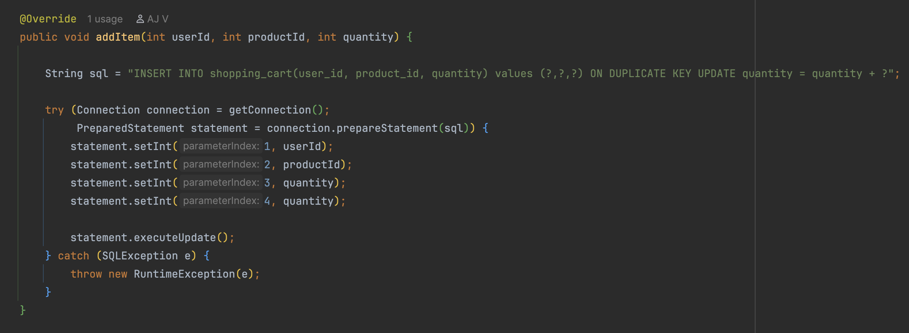
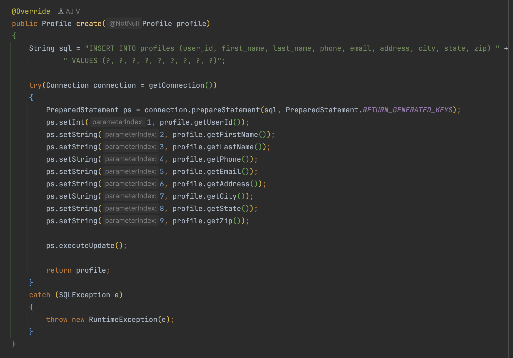

# E-Commerce API - Grocery Shop 🛒

## So what does it do? 
This project is a backend REST API for a grocery based E-commerce site. The goal is to create a functional backend API, 
where users are able to search for products by filtering through price, category, or product type. Users can also create
profiles to either be an admin or non-admin. 

Users can register as either admins or regular users. Regular users can browse products, manage a shopping cart, and update their profile information. Admin users have additional permissions to create categories, add products, and manage inventory. All of this is protected using JWT-based authentication.

The API handles everything from login and authorization to cart persistence and profile management.
### The Process
I built this project in phases. I started by implementing the category controller, then moved on to fixing bugs in the 
provided starter code. After that, I built the shopping cart system from scratch and finished by adding user profile
management. Breaking the project into phases helped keep things manageable and made it easier to test each feature in 
insomnia.
### Bug Fixes
**Bug #1**: Broken Search Filters
Product search wasn't filtering correctly by price or category. The SQL query wasn't handling null parameters properly.
Fixed it by adding null checks and using sentinel values (-1 for numbers, empty strings for text) to indicate when
filters should be ignored.

**Bug #2**: Updates Creating Duplicates
When admins updated a product, it created a duplicate instead of updating the original. The UPDATE statement was 
missing the WHERE clause to specify which product to update. Added WHERE product_id = ? and the problem was solved.
### Shopping Cart
Users can view their cart, add products, update quantities, or 
clear the cart entirely. Cart data is stored in the database, so it persists even after logging out.

The ShoppingCartController includes four endpoints: a GET request to view the cart, POST to add items, PUT to update 
quantities, and DELETE to clear the cart. The database uses a composite primary key (user_id, product_id) to prevent 
duplicate cart items for a single user.
### User Profiles
I added profile management so users can store and update personal information such as their name, email, and address. 
When a user registers, a blank profile is automatically created for them.

There are two main endpoints: GET /profile to view profile information and PUT /profile to update it. Spring Security 
ensures that users can only access and modify their own profile data.
## Database Structure
The database includes seven main tables: users for authentication data, profiles for personal information, categories
for organizing products, products for the product catalog, shopping_cart for cart items, orders for completed purchases,
and order_line_items for individual items within each order.

# Notable Code
I chose to implement the shopping cart and user profile features. I wanted the API to feel more functional like a real 
website a user would want to use. 

The **shopping cart** was one of the more technically challenging areas. It required handling several edge cases, such as 
adding the same product multiple times, ensuring users could only access their own cart data, and persisting cart 
contents across sessions. Solving these problems involved a mix of database design decisions, SQL logic, and security 
considerations, and it helped reinforce how small design choices can impact overall system behavior.

The **profile system** complements the rest of the application by separating authentication data from user-specific 
information. This made it easier to manage user data while keeping the security model clean. Together, the cart and 
profile features move the project closer to a practical e-commerce backend, rather than a collection of isolated 
endpoints.

